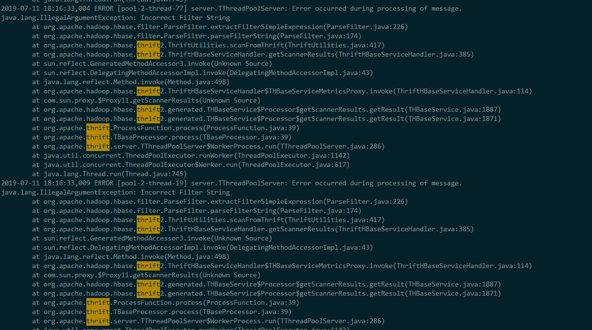
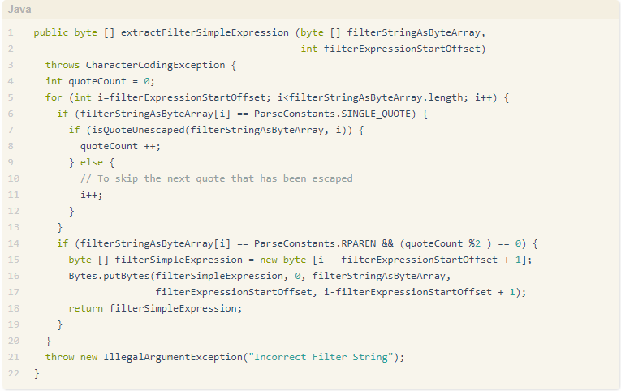

# A disaster triggered by a single quote

## Discription

- Last week, we met a sudden malfunction of an interface ListObjects on our online service. The function of the interface is that scanning the hbase with filter string. The scan hbase request to the apache thrift returned the EOF error, and no more message about the it. Before the sudden malfunction, we did not update our program. And also, there was no update happended to the hbase service. And the service logs show that this interface always worked well before malfunction. It's really a suddden malfunction.

## What happended
### Check the hbase server
- The monitor showed that the hbase server wokred normally at that moment. Also the operations of putting to or getting from the hbase server were ok. 

### Restart Apache Thrift
- Restart the apache thrift, but nothing had changed for the EOF error. 

### Check the hbase server work log
- Checking the hbase server log, we found a error that below. The key message was that: Incorrect Filter String. Yes, the ListObjects interface would send requests bring the filer string that scanning hbase server.

### Incorrect filter string
- From the google, we find this [Incorrect filter string](http://www.zhaif.cc/2017/09/28/python-hbase-tip-3/). It explains from the source code of the hbase that, when the filer string which is not ended with ParseConstants.RPAREN or contains odd number single quotes (') will raise illegalArgumentException: Incorrect Filter String.

### Test our program in test environment
- At that moment, we definitly believed that the root of the error was not from our program. If there was some bugs in our code, it should happen earlier. But when we test the ListObjects interface in our test environment, also, the same error. The hbases of the online service and test environment were endependent, then we test the program with different hbase, it came out same results. There must be a bugs in our code. But how did the Incorrect Filter String suddenly come from? Nothing has changed but the time before the malfuntion.

### Check the code of the ListObjects interface
- Check the code which makes up the request to the hbase server, finding that the filter string contains a value from present time. We get present time as a 4 bytes unsigned integer, then make a conversion for the integer using bigendian byte order, turning out four bytes. Debug the code that, at that period, the value of the four bytes contains a single quote.

### Solution
- As it recommended that from apache hbase [doc](http://hbase.apache.org/book.html#thrift.filter_language), "If single quotes are present in the argument, they must be escaped by an additional preceding single quote."  Then we add some code to fix this bug.

~~~ go
var now bytes.Buffer
if err := binary.Write(&now, binary.BigEndian, uint32(time.Now().Unix())); err != nil {
	merr = NewError(ErrInternal, err.Error())
	return
}
v := now.Bytes()
quote := []byte("'")
if bytes.Count(v, quote) % 2 != 0 {
	v = bytes.ReplaceAll(v, quote, []byte("''"))
}
~~~
